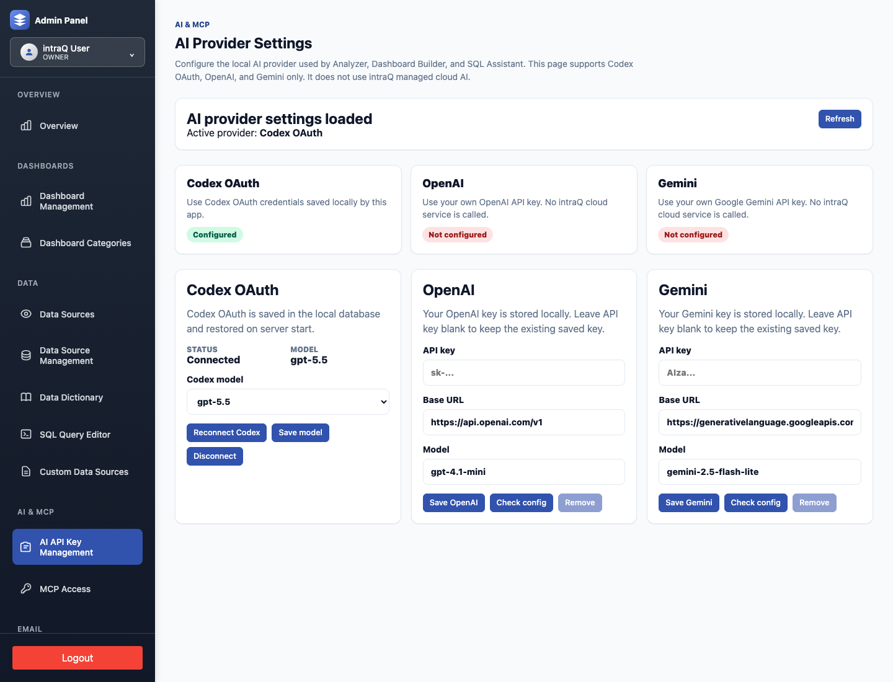
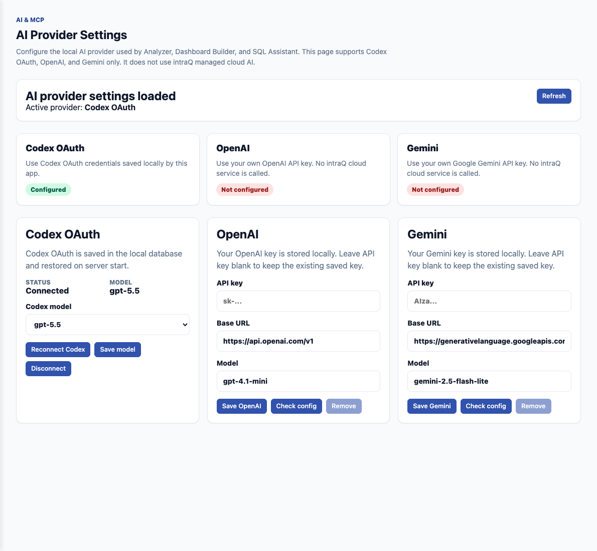

# AI provider setup

intraQ is bring-your-own-provider for AI. The app can use Codex OAuth, OpenAI,
or Gemini for Analyzer, Dashboard Builder, and SQL assistant workflows. It does
not require an intraQ-hosted AI service.

For local/manual contributor testing in this repository workspace, use Codex
OAuth only. Do not put OpenAI or Gemini API keys in local contributor `.env`
files. OpenAI and Gemini keys are intended for self-hosted deployments where the
operator controls the environment and database.

## Open the AI API key page

1. Start intraQ.
2. Sign in as an owner or admin user.
3. Open **Admin → AI & MCP → AI API Key Management**.

Direct paths:

| Runtime | URL |
|---|---|
| Docker Compose default | `http://localhost:4100/admin/ai-api-key-management` |
| Local Vite default | `http://localhost:5173/admin/ai-api-key-management` |

## Choose a provider

The page shows the currently active provider and separate configuration panels
for Codex OAuth, OpenAI, and Gemini.

### Codex OAuth

Use Codex OAuth when developing locally with Codex. The app reads Codex auth
from the local Codex configuration and stores the selected Codex model in the
local app database when persistence is configured.

Use this when:

- you are testing AI behavior on a developer machine;
- you do not want local OpenAI or Gemini API keys;
- you already have Codex authenticated on the machine running intraQ.

### OpenAI

Use OpenAI when you operate a self-hosted intraQ deployment and want Analyzer,
Dashboard Builder, and SQL assistant workflows to call your own OpenAI account.

Set:

- API key;
- base URL, usually `https://api.openai.com/v1`;
- model, for example `gpt-4.1-mini` or another supported model for your account.

### Gemini

Use Gemini when you operate a self-hosted intraQ deployment and want AI workflows
to call your own Google Gemini account.

Set:

- API key;
- base URL, usually `https://generativelanguage.googleapis.com/v1beta`;
- model, for example `gemini-2.5-flash-lite` or another supported model for your
  account.

## Where settings are stored

When `DATABASE_URL` is configured, provider settings are stored in the local
database in `system_settings`:

| Setting | Purpose |
|---|---|
| `ai.provider` | Active provider: `codex`, `openai`, or `gemini`. |
| `ai.provider.openai` | OpenAI base URL, model, and encrypted API key. |
| `ai.provider.gemini` | Gemini base URL, model, and encrypted API key. |
| `codex.oauth.payload` | Codex OAuth payload saved by the Codex auth flow. |
| `codex.model` | Selected Codex model. |

OpenAI and Gemini API keys are encrypted before being stored. The encryption
secret is resolved from `AI_CONFIGURATION_ENCRYPTION_KEY`, `AUTH_TOKEN_SECRET`,
`SESSION_SECRET`, or `ENCRYPTION_KEY`, depending on what is configured.

If `DATABASE_URL` is not configured, the page still loads with safe defaults for
development, but UI-saved settings are not durable across restarts. Use a real
database-backed `.env` for normal self-hosted use.

## Environment variable fallback

The UI is the recommended setup path for self-hosted operators. Environment
variables can also provide defaults:

| Variable | Purpose |
|---|---|
| `AI_AGENT_PROVIDER` | Active provider: `codex`, `openai`, or `gemini`. |
| `CODEX_HOME` / `CODEX_AUTH_PATH` | Codex OAuth location. |
| `CODEX_MODEL` | Codex model override. |
| `OPENAI_API_KEY` | OpenAI API key. |
| `OPENAI_API_ENDPOINT` | OpenAI-compatible base URL. |
| `OPENAI_MODEL` | OpenAI model. |
| `GEMINI_API_KEY` / `GOOGLE_GEMINI_API_KEY` | Gemini API key. |
| `GEMINI_API_ENDPOINT` | Gemini base URL. |
| `GEMINI_MODEL` | Gemini model. |

See [Configuration](CONFIGURATION.md) for the full environment-variable list.

## Validate the setup

After saving provider settings:

1. Click **Check config** for OpenAI or Gemini to confirm required values are
   present.
2. Ask a simple Analyzer question against seeded or connected data.
3. Confirm the answer includes grounded context from your local data models.

The config check confirms local configuration exists. The real end-to-end test
is an Analyzer, Dashboard Builder, or SQL assistant request using your own data.
