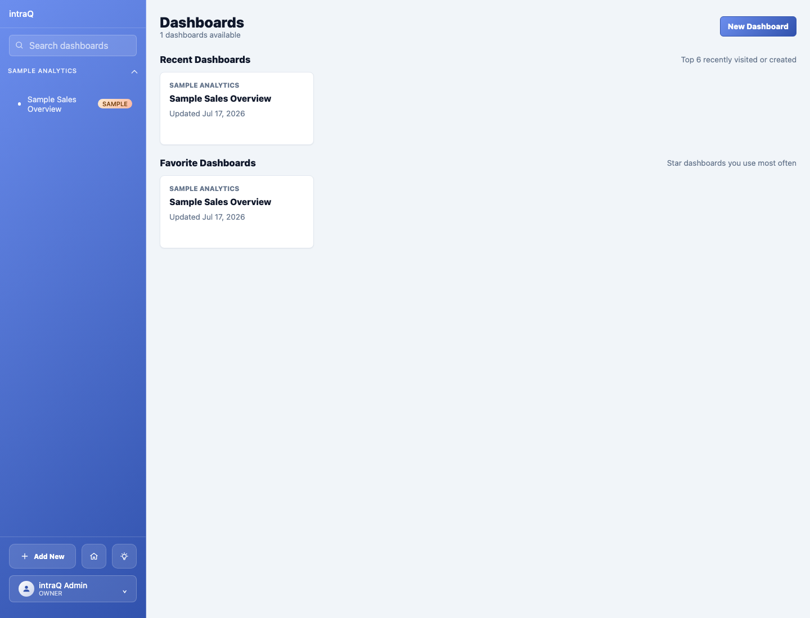
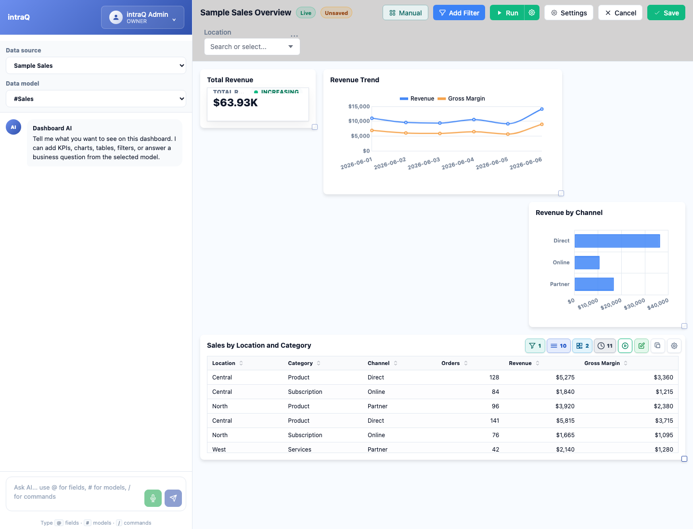
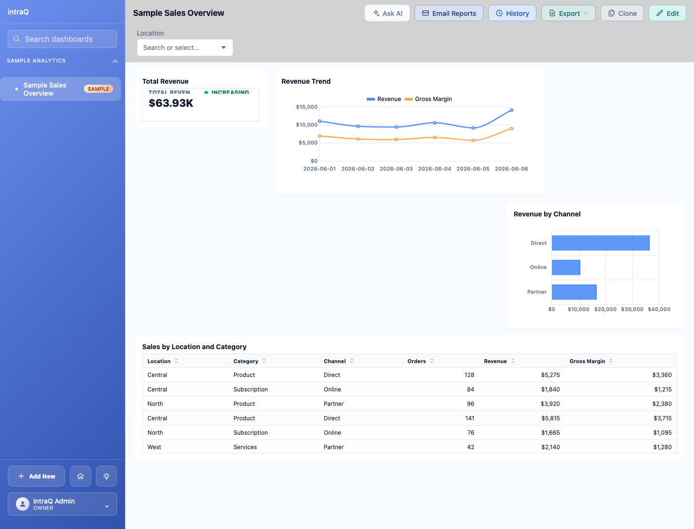
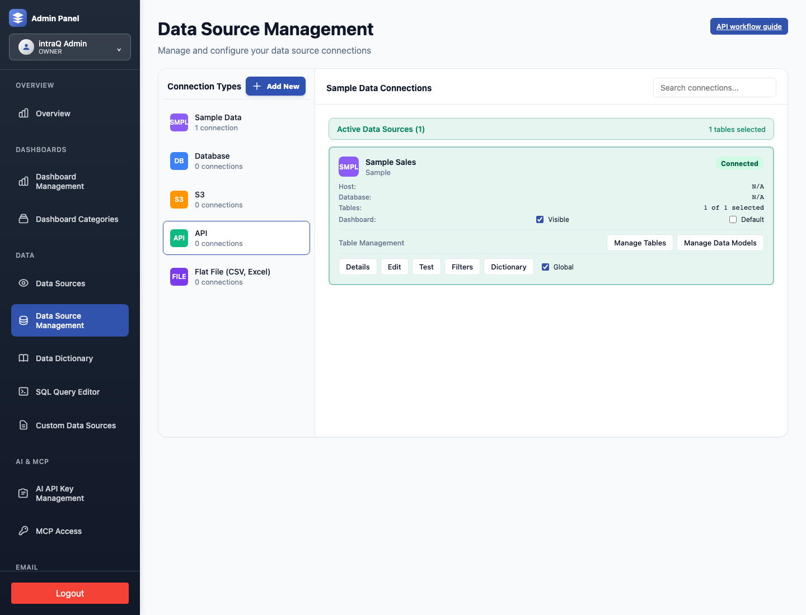
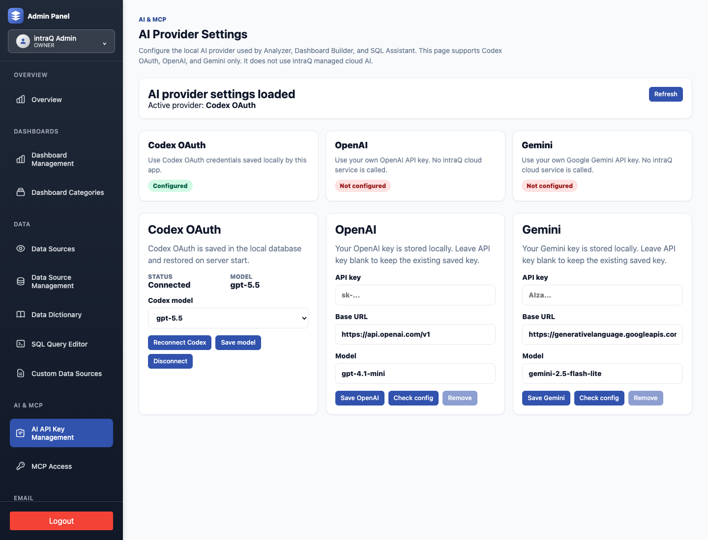

# Demo guide

This guide gives new users a fast path from first run to a working intraQ demo.
The seed data is generic sales data, so it is safe for public docs, screenshots,
and walkthrough videos.

## What the demo includes

After running the database seed, intraQ creates:

- a local owner login;
- a sample sales data source;
- a dashboard-ready `sample_sales_model` table;
- a published **Sample Sales Overview** starter dashboard;
- a dashboard category named **Sample Analytics**.









Seeded local login:

| Email | Password |
|---|---|
| `admin@local.intraq.test` | `intraq-demo` |

## Run the demo

### Docker Compose

```bash
cp .env.example .env
docker compose up --build
```

Open `http://localhost:4100`.

If port `4100` is busy:

```bash
INTRAQ_PORT=4110 docker compose up --build
```

Then open `http://localhost:4110`.

### Local development

```bash
nvm use
npm ci
cp .env.example .env
```

Edit `.env` and set a real local PostgreSQL `DATABASE_URL` plus a 32+ character
`AUTH_TOKEN_SECRET`, then run:

```bash
npm run db:migrate
npm run db:seed
npm run dev
```

Open `http://localhost:5173`.

## Product tour path

Use this sequence for screenshots, GIFs, or short product videos.

1. Log in as `admin@local.intraq.test`.
2. Open **Dashboard** and select **Sample Sales Overview**.
3. Show the KPI card, revenue trend, channel chart, and location filter.
4. Open **Data Sources** and show the **Sample Sales** model metadata.
5. Open **AI Analyzer** and ask: `Which channel has the highest revenue?`
6. Open **Dashboard Builder** and show how a user can add or edit a chart.
7. Open **Admin → AI & MCP → AI API Key Management** and show Codex, OpenAI,
   and Gemini setup options.



## Suggested demo questions

Use these with the seeded sample data:

- `How is revenue trending by day?`
- `Which channel has the highest revenue?`
- `Compare revenue and gross margin by category.`
- `Which location has the highest average order value?`
- `Create a dashboard chart for revenue by channel.`

## Short video scripts

Keep videos short and specific. Record real app screens only; do not use mock
video placeholders.

### 60-second overview

1. Start on the dashboard list.
2. Open **Sample Sales Overview**.
3. Point out the seeded data source, filters, KPI, and charts.
4. Ask one Analyzer question against the sample data.
5. End on AI provider setup to show users how to connect their own provider.

### 2-minute setup walkthrough

1. Show `cp .env.example .env` and `docker compose up --build`.
2. Open the app and log in with the seeded owner account.
3. Open the starter dashboard.
4. Open Data Sources and show the sample model fields.
5. Mention where AI provider setup lives.

### 3-minute dashboard builder walkthrough

1. Open the starter dashboard.
2. Duplicate or create a dashboard.
3. Add a chart for revenue by channel or gross margin by category.
4. Apply the location filter.
5. Save/publish the dashboard.

## Capture screenshots

Once the app is running with seeded data, capture screenshots manually or with
Playwright. Good screenshots for docs are:

- dashboard list with **Sample Sales Overview** visible;
- the full **Sample Sales Overview** dashboard;
- the **Sample Sales** data-source fields;
- the **AI API Key Management** page.

Do not commit screenshots that include real customer data, real API keys,
private URLs, or personal accounts.

You can also use the bundled capture script after the app is running:

```bash
npm run demo:capture
```

Useful overrides:

```bash
INTRAQ_DEMO_BASE_URL=http://127.0.0.1:4110 npm run demo:capture
INTRAQ_DEMO_OUTPUT_DIR=/tmp/intraq-demo-assets npm run demo:capture
```

The script writes screenshots to `docs/assets/demo` by default. Review every
generated image before deciding whether to commit it or upload it to the website.
